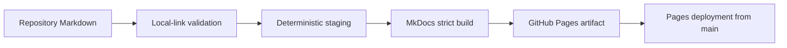

# Documentation status and publication model

## Purpose

This page defines which repository artefacts are authoritative, how documentation coverage is evaluated, and what evidence the publication pipeline produces.

## Documentation authority

| Artefact | Authority and scope | Verification evidence |
| --- | --- | --- |
| `README.md` | Repository entry point, implementation scope, quick start, and protocol summary | Included as the GitHub Pages home page and validated by the strict site build |
| `NAMING.md` | Canonical naming and terminology decisions | Local-link validation and publication build |
| `docs/` | Protocol, architecture, implementation, deployment, and assurance guidance | Full navigation coverage in `mkdocs.yml` |
| Component `README.md` files | Module-specific contracts, configuration, and operational behavior | Published under component-specific navigation sections |
| Changelogs and release notes | Historical implementation and assurance evidence | Published under “Changelogs and releases” |
| Source code and tests | Executable behavior; authoritative where narrative and implementation diverge | `pytest` and repository CI |

## Publication coverage

The documentation workflow stages every Markdown file in the repository and builds the site with MkDocs in strict mode. The navigation explicitly exposes normative and operator-facing material. Markdown not listed in navigation is still staged, causing strict-mode warnings and preventing silent documentation orphaning.



## Quality gates

A documentation change is commit-ready only when:

1. local Markdown links resolve;
2. every Markdown artefact is staged for publication;
3. `mkdocs build --strict` succeeds;
4. the Python test suite collects and executes using the repository-defined import paths;
5. deferred behavior is identified as either a deliberate version boundary or actionable repository debt.

## Maintainer commands

```bash
python -m pip install -r requirements-docs.txt
python scripts/check_markdown_links.py
python scripts/stage_docs.py
mkdocs build --strict
python -m pytest
```

The generated `.pages-src/` and `site/` directories are build products and must not be committed.
